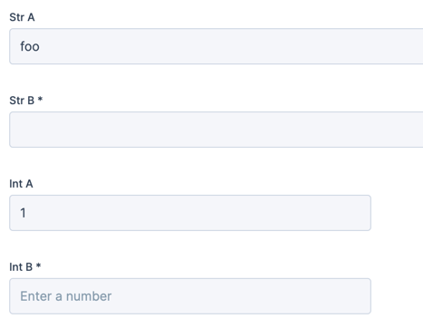
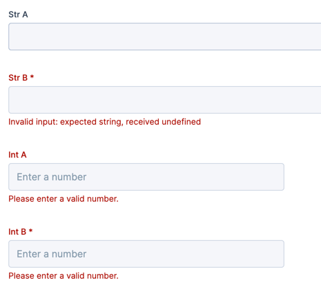
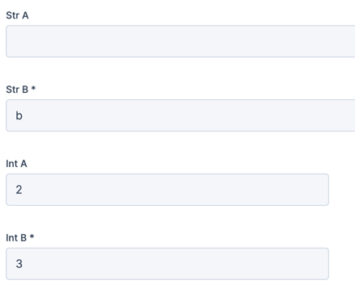

# Required fields on forms with defaults

* Date: 2026-08-10

There is an intricate (but not critical) problem in pydantic-forms which has not been solved yet.
It relates to using pydantic-forms with default values and how this changes the representation in a UI.

For lack of a straightforward solution I decided to document this to fall back to in discussions
and to ensure everybody is on the same page.

The subsections will explain the problem step by step.

## Required fields

A field is required when it does not have a default value:

```python
class MyForm(FormPage):
    my_field: str
```

When validating data with this form, `my_field` must be specified and contain a string value.

When a field does have a default value, it is no longer required:

```python
class MyForm(FormPage):
    my_field: str = "foo"
```

This means that when validating data with this form, if `my_field` is not in the data then it's default value `"foo"` is used instead.

## API vs UI

The implication of a field not being required depends on the context from which a form is submitted.
We can identify 2 different ones:

1. API: submitting form payload directly to an HTTP endpoint
2. UI: submitting form data through a user interface, which in turn uses the API

When submitting to an API, an optional field can simply be left out of the payload.

However, when using a UI to submit a form this will typically contain all form data and not a subset.
This is because it would require knowledge on the UI side to distinguish for each form field the difference between "no value" or an "empty value".

## A simple form

Let's imagine a simple form that requires the user to provide all values for a new data object:

```python
# Model of the data object
class MyObject(BaseModel):
    x: str


# Form definition
class MyCreateForm(FormPage):
    my_field: str


# User provides initial values which are validated through the form
initial_data = MyCreateForm(my_field="foo")

# Data object is created with the initial values
new_object = MyObject(x=initial_data.my_field)
```

This example is overly simplified and cuts out several steps so as to focus on the core problem.

## A form with default values

A form can contain default values to improve the user experience, for example to modify existing
data or to suggest sensible default values.
Regardless of the usecase, the default values become part of the form's JSON schema that is returned to the caller.

```python
# Model of the data object
class MyObject(BaseModel):
    x: str


# Data object already exists
existing_object = MyObject(x="bar")


# Form definition
class MyModifyForm(FormPage):
    my_field: str = existing_object.x


# User provides (un)modified values which are validated through the form
modify_data = MyModifyForm(my_field="foo")

# Data object is updated with the (un)modified values
existing_object.x = modify_data.my_field
```

## The problem

As stated before, a field with a default value is no longer required.
This can be observed by rendering the JSON schema of this form:

```python
from pydantic_forms.core import FormPage
from pprint import pprint


class MyModifyForm(FormPage):
    str_a: str = "foo"
    str_b: str
    int_a: int = 1
    int_b: int


pprint(MyModifyForm.model_json_schema())
```

The output shows `str_a` and `int_a` have a default value, while `str_b` and `int_b` are in `required`:

<!-- TODO convert to pycon block -->

```python
{
    "additionalProperties": False,
    "properties": {
        "int_a": {"default": 1, "title": "Int A", "type": "integer"},
        "int_b": {"title": "Int B", "type": "integer"},
        "str_a": {"default": "foo", "title": "Str A", "type": "string"},
        "str_b": {"title": "Str B", "type": "string"},
    },
    "required": ["str_b", "int_b"],
    "title": "unknown",
    "type": "object",
}
```

In a UI, such as the orchestrator-ui-library, this form looks like this:

/// details | Form generator code
    type: info
```python
def initial_input_form_generator() -> FormGenerator:

    class MyModifyForm(FormPage):
        str_a: str = "foo"
        str_b: str
        int_a: int = 1
        int_b: int

    form1 = yield MyModifyForm
```
///



Trying to make the fields empty shows an error for 3 out of 4 fields:



From this we can observe that:

- `int_a` cannot be empty: even if it has a default value on the backend, the UI must always submit all fields
- `int_a` is not shown as required, while it is
- `str_a` can be empty, it will probably fallback to its default value?

So let's fill in the bare minimum and see what the API receives:



/// details | Form generator code
    type: info
```python
def initial_input_form_generator() -> FormGenerator:

    class MyModifyForm(FormPage):
        str_a: str = "foo"
        str_b: str
        int_a: int = 1
        int_b: int

    form1 = yield MyModifyForm

    received = f"str_a: {form1.str_a}\nstr_b: {form1.str_b}\nint_a: {form1.int_a}\nint_b: {form1.int_b}"

    class ReadonlyForm(FormPage):
        values: LongText = received

    yield ReadonlyForm
```
///

And on the next page it shows these values:

```
str_a:
str_b: b
int_a: 2
int_b: 3
```

`str_a` did _not_ fallback to its default value, but it accepted the empty string as a value. An empty string is still
a string.

### Question 1

What do we actually want to tell the user by showing an asterisk (`*`) near a form field in the UI?

Some possible answers:

#### 1. That a field requires action before submitting

The current behavior as of 2026-08-10.

It tells the user that fields with a default value do not need to be changed by the user to reach the next page.

Conversely, it tells the user that fields without a default value need to be filled in to reach the next page.
(This is currently not perfectly handled, as described in [Question 3](#question-3))

When choosing this, also see [Question 2](#question-2)

#### 2. That a field is required by the API

This means that we would show a `*` for all fields that we know require a value by the API.

It tells the user that fields with a default value should not be made empty.

For fields without a default value, this is identical to answer 1.

### Question 2

If the user makes a field empty that had a default value, do we want to re-render it as required, or does it suffice to
show the validation error from the backend?

### Question 3

Should `str_b` be shown as a required field, if the type is just `str` with no other requirements?

We could choose to only show strings as required if they declare a minimum length or non-empty regex.
It may be perfectly valid to accept empty strings as values, and this is now not easily possible.

The same holds for `list` fields without a minimal length requirement.
